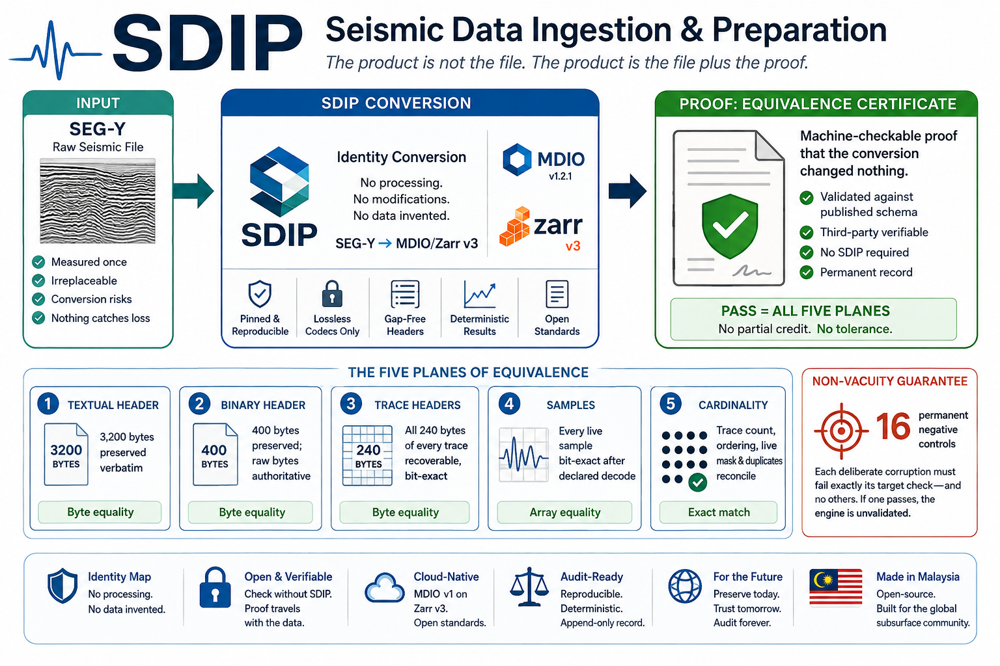

<div align="center">



<br />
<br />

# 🌊 SDIP — Seismic Data Ingestion & Preparation

### Convert **SEG-Y** seismic data into an **AI-ready MDIO / Zarr v3** store — with a machine-checkable proof the conversion changed nothing.

*The product is not the file. The product is the file plus the proof.*

<br />

**Zahid Aramai**

<br />

[](https://www.python.org)
[](https://github.com/TGSAI/mdio-python)
[](https://zarr.dev)
[](https://github.com/TGSAI/segy)
[](https://numpy.org)
[](https://docs.astral.sh/uv/)

<br />


</div>

---

**SDIP** is an open-source **Python** toolchain that converts **SEG-Y** seismic data into **MDIO v1 on Zarr v3** — a chunked, cloud-native, **AI-ready seismic data format** that `zarr`, `xarray`, `dask` and `TensorStore` open directly — and issues an **Equivalence Certificate**: a machine-checkable proof that the conversion was **lossless and bit-exact**.

```text
SEG-Y  ──▶  SDIP (identity conversion)  ──▶  MDIO / Zarr v3  +  Equivalence Certificate
```

No processing. No modification. No data invented. **Just the format change, plus the receipt.**

---

## Contents

- [What is SDIP?](#what-is-sdip)
- [Why SEG-Y is the wrong input for AI/ML](#why-seg-y-is-the-wrong-input-for-aiml)
- [SEG-Y vs MDIO / Zarr v3 for machine learning](#seg-y-vs-mdio--zarr-v3-for-machine-learning)
- [Install](#install)
- [How to convert SEG-Y to MDIO / Zarr v3](#how-to-convert-seg-y-to-mdio--zarr-v3)
- [How to load the converted seismic data in Python](#how-to-load-the-converted-seismic-data-in-python)
- [The Equivalence Certificate](#the-equivalence-certificate)
- [Why the proof is worth anything](#why-the-proof-is-worth-anything)
- [Who uses this](#who-uses-this)
- [Supported formats and scope](#supported-formats-and-scope)
- [CLI reference](#cli-reference)
- [FAQ](#faq)
- [Contributing](#contributing)
- [License](#license)

---

## What is SDIP?

SDIP is a **SEG-Y to Zarr converter** built for one job: turning seismic volumes into an **array format an AI/ML pipeline can actually train on**, and proving the arrays still hold exactly what the SEG-Y held.

It does three things:

1. **Converts** — SEG-Y → **MDIO v1 / Zarr v3**, chunked, compressed with lossless codecs only, ready for parallel and cloud-native reads.
2. **Proves** — runs an **Equivalence Engine** over five independent planes and exports back to SEG-Y for a whole-file SHA-256 comparison.
3. **Certifies** — writes a **JSON certificate**, validated against a published schema, that anyone can check **without installing SDIP**.

What it is **not**: a processing tool. There is no filtering, scaling, resampling, regridding, muting, interpolation or denoising anywhere in it. It is an **identity map with a receipt**.

---

## Why SEG-Y is the wrong input for AI/ML

Seismic data lives in **SEG-Y**, a format designed for magnetic tape. Machine learning consumes **arrays** — chunked, randomly addressable, read in parallel from object storage by dozens of workers at once.

SEG-Y cannot serve that, and no amount of tuning changes it:

- It is a **sequential layout** — traces written end to end, each preceded by a 240-byte header.
- There is **no chunking and no random access**. Reading an inline means seeking across the whole file.
- There is **no schema** a data loader can address. Header meaning is a per-vendor convention, not a contract.
- It does not sit well **in object storage**. A single multi-gigabyte blob is not a parallel read.

So the data has to be converted — and **that conversion is where the trouble is.** Every SEG-Y conversion is a chance to lose something quietly: a header field dropped because a parser never named it, a sample altered because a decode was not exactly invertible, a trace mislabelled because a grid was regularised.

**Nothing catches it.** The conversion succeeds. The store opens. The volume looks right. And a model cannot tell the difference:

| What the conversion did | What the model sees |
|---|---|
| Dropped a trace header field | A missing feature — trained without it, and nobody knows what was lost |
| Altered a sample through a non-invertible decode | Signal. It learns it |
| Regularised the grid | Geometry. Every prediction inherits it |
| Mislabelled or reordered traces | A wrong label, propagated through every epoch |

Corrupted input does not announce itself in a loss curve. It surfaces as a model that scores well in validation and fails on real data.

**Plenty of tools convert SEG-Y. What has been missing is the receipt.** SDIP is the converter that hands you one.

---

## SEG-Y vs MDIO / Zarr v3 for machine learning

| | **SEG-Y** | **MDIO v1 / Zarr v3** (what SDIP writes) |
|---|---|---|
| Designed for | Magnetic tape, sequential | Chunked N-dimensional arrays |
| Random access | No — seek across the file | Yes — read one chunk |
| Parallel reads | Effectively no | Yes, chunk-level concurrency |
| Cloud / object storage | One large opaque blob | Native; each chunk is an object |
| Reads into NumPy | Needs a SEG-Y parser | Directly, via `zarr` or `xarray` |
| `dask` / out-of-core | No | Yes |
| Non-Python readers | Format-specific libraries | `TensorStore` (C++), any Zarr v3 reader |
| Schema for headers | Per-vendor convention | Named, typed fields on the store |
| Compression | Rarely | Lossless codecs, per chunk |
| Open standard | Yes (SEG technical standard) | Yes (Zarr v3 + MDIO v1, no vendor lock-in) |

SDIP takes you from the left column to the right one **without changing a single measured value** — and proves it.

---

## Install

Requires **Python 3.12–3.13**.

**Container — nothing to install but Docker.** The image carries the pinned decoder, and
`doctor` verifies those pins inside it, so you are running the same `multidimio` and
`segy` a certificate would be issued under:

```bash
docker run --rm -v "$PWD:/work" ghcr.io/zahidaramai/sdip:latest \
    verify /work/survey.sgy /work/survey.mdio
```

**From source:**

```bash
git clone https://github.com/zahidaramai/sdip && cd sdip
uv sync --all-extras --dev

uv run sdip doctor          # environment sanity; runs first, always
```

**As a package** — wheel and sdist are attached to every
[release](https://github.com/zahidaramai/sdip/releases):

```bash
pip install git+https://github.com/zahidaramai/sdip@v1.1.0
```

> **Not on PyPI, npm or NuGet, and that is a decision rather than an omission.** PyPI is a
> support commitment. npm and NuGet cannot run a Python library at all — a package there
> would install cleanly and fail at first use, which is precisely the shape of failure
> this project exists to prevent.

`sdip doctor` checks the Python version, the binding upstream pins, barred packages and environment variables, runtime licences and the working tree. **If it fails, nothing else runs** — a certificate from an unsound environment is not a certificate.

---

## How to convert SEG-Y to MDIO / Zarr v3

The full chain — convert, verify, certify — is one command:

```bash
uv run sdip certify survey.sgy survey.mdio \
    --rss-ceiling-gib 8.0 \
    --wall-ceiling-s 1500
```

That ingests the SEG-Y, runs **all five planes of equivalence**, exports back to SEG-Y and compares the whole file by **SHA-256**, checks the store opens with **stock `zarr` and `xarray` with MDIO uninstalled**, runs the **negative controls**, and writes the certificate.

Or convert only:

```bash
uv run sdip ingest survey.sgy survey.mdio --revision 1 --template PostStack3DTime
```

And verify a store you already have:

```bash
uv run sdip verify survey.sgy survey.mdio
```

> ⚠️ **Ingestion must sit behind `if __name__ == "__main__":`** when you call it from a Python script. MDIO's header parser uses a `spawn` multiprocessing context; without the guard the child re-executes your script. This is measured, not theoretical.

---

## How to load the converted seismic data in Python

The output is **plain Zarr v3**. Neither SDIP nor MDIO is needed to read it — that portability is a gate the engine enforces, not a hope.

**With `xarray`:**

```python
import xarray as xr

ds = xr.open_zarr("survey.mdio", consolidated=False)
print(ds)
# data vars:   amplitude, headers, headers_raw_uint8, trace_mask, ...
# coords:      inline, crossline, time, cdp_x, cdp_y

volume = ds["amplitude"]  # dims ('inline', 'crossline', 'time'), lazy + dask-backed
inline_42 = volume.sel(inline=42).values  # label-based, straight to NumPy
```

**With `zarr` directly:**

```python
import zarr

store = zarr.open_group("survey.mdio", mode="r")
amplitude = store["amplitude"]  # samples, (inline, crossline, time), float32
headers = store["headers"]  # structured array, 97 named trace-header fields
mask = store["trace_mask"][...]  # which traces are live
raw_bytes = store["headers_raw_uint8"]  # all 240 header bytes per trace, verbatim

tile = amplitude[100:132, 200:232, :]  # chunk-level random access — NumPy from here on
```

**Into a training loop:** the arrays are NumPy-compatible and chunk-addressable, so a `torch.utils.data.Dataset` (or a `tf.data` pipeline) is a thin wrapper — slice the region you want per `__getitem__` and let Zarr fetch only the chunks it touches. SDIP deliberately ships no data loader of its own; the store is a standard one, so yours works.

**From C++ or another language:** the core arrays read byte-identically through **TensorStore**, measured field by field.

---

## The Equivalence Certificate

The certificate is a **JSON document**, validated against a published schema, that a third party can check **without running SDIP**. It records what was compared, how, and with what result:

| Plane | The claim it settles |
|---|---|
| **1. Textual header** | The 3,200 bytes are preserved verbatim |
| **2. Binary header** | The 400 bytes are preserved; the raw bytes are authoritative |
| **3. Trace headers** | All **240 bytes** of every trace are recoverable, bit-exact |
| **4. Samples** | Every live sample is bit-exact after the declared decode |
| **5. Cardinality** | Trace count, ordering, live mask and duplicates all reconcile |

**All five must hold simultaneously.** There is no partial credit and no "mostly equivalent" — a store that satisfies four planes is `NON-EQUIVALENT`, and the certificate says which plane failed and where.

Comparisons are **byte equality** or `array_equal`. **There is no tolerance anywhere in the engine**, because a tolerance is how a lossy path gets a passing grade.

---

## Why the proof is worth anything

**A gate a corrupted store passes is not a gate.**

The engine ships **16 permanent negative controls** — deliberate corruptions that *must* fail, each required to fail **exactly** the check it targets and no others. One flipped bit in one sample. One flipped header byte. A dropped trace. Two transposed traces. An inverted live mask. A truncated textual header. A deleted array.

If a corruption passes, or fails the wrong check, **the whole engine is treated as unvalidated** — because a checker that cannot localise a fault cannot be trusted to have found one.

That is the difference between a tool that reports success and a tool whose success means something.

---

## Who uses this

**You are building a seismic ML training set.** Your platform reads arrays, not tapes. SDIP gives you the arrays and a per-survey provenance record that says they are the SEG-Y — checkable before a single epoch runs.

**You are migrating a survey to the cloud.** The conversion either preserved the data or it did not, and "the volume looked fine" is not an answer you can hand to anyone.

**You received data from someone else.** A certificate travels with the store and verifies independently — you do not have to trust the sender's toolchain, or run it.

**You are building on converted data.** An inversion or a 4D study inherits every defect upstream of it. A certificate turns "we think the conversion was clean" into something with a number behind it.

**You are the custodian of an archive.** Formats age, and the migration you run today is the one someone audits in twenty years. SDIP writes down what it did, in a form that outlives the person who ran it.

---

## Supported formats and scope

| | Status |
|---|---|
| **SEG-Y revisions** | Base specs for **rev 0, 1, 2, 2.1**; certified end to end on **rev 1** |
| **Geometry** | **Poststack 3-D** (`PostStack3DTime`); other templates come from MDIO's registry |
| **Endianness** | Big-endian, measured |
| **Sample formats** | All 11 codes the pinned `segy` can express, swept and classified: **5 decode exactly** (`int8`, `int16`, `uint8`, `uint16`, `float32`), **6 can alter a value** (`ibm32`, `int32`, `int64`, `uint32`, `uint64`, `float64`). For the six, an `EQUIVALENT` verdict requires a **byte-identical whole-file round trip** — otherwise SDIP refuses it |
| **Trace headers** | Gap-free spec, **97 named fields**, all 240 bytes covered |
| **Output** | **MDIO v1.2.1** on **Zarr v3**, lossless codecs only |
| **Storage** | Local filesystem measured; cloud object-store backends are an open debt |

SDIP has issued a certificate on a real survey: **494,565,408 bytes, 116,532 traces**, SEG-Y rev 1, big-endian, poststack 3-D — every check passing, from a clean working tree.

It is **deliberately narrow**. Where a format, geometry or backend has not been measured, SDIP **refuses with a named reason** rather than converting it anyway. A tool that half-works on data it does not understand produces exactly the artifact this project exists to prevent.

Everything measured is recorded in [`DECISIONS.md`](DECISIONS.md); everything not yet measured is in [`OPEN_DEBTS.md`](OPEN_DEBTS.md), each naming the experiment that would settle it. Issued certificates are indexed in [`EQUIVALENCE_LEDGER.md`](EQUIVALENCE_LEDGER.md).

---

## CLI reference

| Command | What it does |
|---|---|
| `sdip doctor` | Environment sanity. If it fails, nothing else runs |
| `sdip spec build` | Build a gap-free trace-header specification |
| `sdip ingest` | **SEG-Y → MDIO / Zarr v3** |
| `sdip verify` | Run the Equivalence Engine against an existing store |
| `sdip export` | **MDIO → SEG-Y** |
| `sdip certify` | The full chain, ending in a certificate |

**In the container, `certify` needs a git working tree** — it refuses to issue from one
that is dirty or absent, so mount a repository if you want a certificate. `ingest`,
`verify` and `export` need nothing but the data. For the same reason `doctor` reports two
failures in a bare container: both are about *this repository's* development discipline,
not your environment.

---

## FAQ

**Does SDIP modify or process my seismic data?**
No. There is no filtering, scaling, resampling, regridding, muting, interpolation or denoising anywhere in it. It is an identity map — the format changes, the values do not — and the certificate is the proof.

**Do I need SDIP or MDIO installed to read the output?**
No. The output is standard **Zarr v3**. It opens with stock `zarr` and `xarray`, and the core arrays read from C++ through `TensorStore`. That the store opens with MDIO *uninstalled* is a gate the engine enforces on every certified run.

**Is this lossless? Can I get my original SEG-Y back?**
Yes — `sdip export` writes MDIO back to SEG-Y, and `sdip certify` compares the round-tripped file to the source by **SHA-256** over the whole file. Compression uses lossless codecs only; MDIO's `lossy` extra (`zfpy`) is barred outright.

**What about `ibm32` and the decode to `float32`?**
MDIO stores samples as `float32`, so the decode is always `<source format> → float32`. Six source formats can alter a value that way, `ibm32` among them. SDIP does not hand-wave it and does not blanket-refuse it either: it declares the transform on the certificate, and grants `EQUIVALENT` only when the **whole-file round trip is byte-identical** — which is a measurement that every source word re-encoded to the bits it came from. No round trip, no verdict.

**Why MDIO / Zarr v3 rather than HDF5 or a custom format?**
Because it is an open standard nobody owns, it is chunked and cloud-native by design, and it is already what the scientific Python stack reads. SDIP does not invent a format — it adopts **MDIO v1** and pins its upstream dependencies exactly, because a certificate issued under one version of a decoder says nothing about another.

**How do I use the converted data with PyTorch or TensorFlow?**
Read it with `zarr` or `xarray` and slice per sample. The arrays are NumPy-compatible and chunk-addressable, so a `Dataset` wrapper is a few lines. SDIP ships no loader of its own on purpose — a standard store works with the one you already have.

**Which SEG-Y revisions and geometries work?**
See [Supported formats and scope](#supported-formats-and-scope). Where something has not been measured, SDIP refuses with a named reason rather than guessing.

**What happens if the conversion is not equivalent?**
The certificate says `NON-EQUIVALENT` and names the plane that failed and where. Four planes out of five is a failure, not a pass.

**Is it production-ready?**
It is early and honest about it. Everything measured is in [`DECISIONS.md`](DECISIONS.md); everything unmeasured is in [`OPEN_DEBTS.md`](OPEN_DEBTS.md) with the experiment that would close it.

---

## Contributing

Contributions are welcome under Apache-2.0 with a DCO sign-off. Start with [`CONTRIBUTING.md`](CONTRIBUTING.md) — it states the rules a change is held to, and invites an issue wherever a rule is unclear.

Security issues: [report privately](https://github.com/zahidaramai/sdip/security/advisories/new). SDIP parses binary files it did not create, so it treats untrusted input as a real attack surface — see [`SECURITY.md`](SECURITY.md).

---

## License

**Apache-2.0.** See [`LICENSE`](LICENSE) and [`NOTICE`](NOTICE).

The round-trip test fixture is adapted from [`TGSAI/mdio-python`](https://github.com/TGSAI/mdio-python) (Apache-2.0); attribution in `NOTICE` is a legal obligation and survives refactors.

---

<details>
<summary><strong>Topics & keywords</strong></summary>

`segy` · `seg-y` · `segy-converter` · `segy-to-zarr` · `segy-to-mdio` · `mdio` · `zarr` · `zarr-v3` · `seismic` · `seismic-data` · `seismic-processing` · `geophysics` · `subsurface` · `machine-learning` · `deep-learning` · `ai-ready-data` · `training-data` · `data-conversion` · `lossless` · `data-validation` · `equivalence` · `provenance` · `reproducibility` · `cloud-native` · `object-storage` · `xarray` · `dask` · `numpy` · `tensorstore` · `python` · `open-data` · `energy` · `oil-and-gas`

Common searches this project answers: *convert SEG-Y to Zarr* · *SEG-Y to MDIO converter* · *AI-ready seismic data format* · *cloud-native seismic format* · *seismic data for machine learning* · *lossless SEG-Y conversion* · *SEG-Y Python library* · *seismic training data pipeline* · *read SEG-Y with xarray* · *verify seismic data conversion*

</details>

---

<div align="center">

Built as an open-source contribution to the subsurface data community
Kuala Lumpur, Malaysia

© 2026 **Zahid Aramai** (M Zahid B Zamanshah) · Licensed under Apache-2.0

*The product is not the file. The product is the file plus the proof.*

</div>
